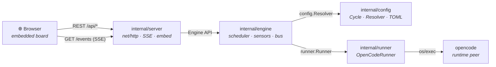

# symvibe — Vibe Coding Baukasten

[](https://github.com/danieljustus/symaira-vibecoder/actions/workflows/ci.yml)
[](https://github.com/danieljustus/symaira-vibecoder/releases)
[](https://go.dev/)
[](https://opensource.org/licenses/MIT)

> Eine schlanke grafische Oberfläche, die deinen **Cycle** (Cleaning → Code
> Review → Planung → Coden → PR-Check → GH Alerts → Pre-Release → Release)
> autonom durchläuft — angetrieben von **opencode**, mit Modell-Auswahl pro
> Kategorie *und* pro Schritt, Subagents und dezenten Status-Symbolen.

`symvibe` ist Teil des Symaira-Ökosystems: ein einzelnes, CGO-freies Go-Binary,
das ein **Baukasten-Board** auf `127.0.0.1` serviert. Du baust deinen Cycle aus
verschiebbaren Karten zusammen (hinzufügen / entfernen / bearbeiten / per
Drag-&-Drop umsortieren) und sagst dem Tool, es soll loslaufen — der Rest
passiert autonom.

## Architecture



## Features

- **Baukasten UX** — drag-and-drop cycle builder with customizable phases and steps
- **opencode integration** — drives opencode headless via `Runner` interface (no fork required)
- **Model bindings per category/step** — assign different AI models to different parts of your cycle
- **Autonomous cycle execution** — run your entire workflow with a single click
- **iOS/macOS client** — native SwiftUI client for monitoring and controlling cycles

```
  symvibe serve  →  http://127.0.0.1:4317
  ┌──────────── Cycle ────────────────────────────────┐
  │ ① Cleaning   ◐ 1.1 Branch   ○ 1.2 Commits          │
  │ ② Code Review ✓ 2.1 Quality  ○ 2.2 Simplify …      │
  │ …  [Karten ziehen · $skill · ▦ kategorie · ▶ run]  │
  └────────────────────────────────────────────────────┘
   ○ pending  ◐ running  ✓ done  – skipped  ✕ failed  ⦸ blocked  ! review
```

## Warum kein Fork von opencode?

`symvibe` **forkt opencode nicht** — es *steuert* es über ein austauschbares
`Runner`-Interface. opencode liefert headless bereits alles, was nötig ist
(`opencode run --format json`, `--agent/--model/--variant`, Sessions, Skills).
Ein Fork würde bedeuten, die gesamte Provider-/Tool-/Session-Maschinerie zu
erben und ewig zu pflegen. So gehört dir die *Vision*-Schicht (Cycle, Baukasten,
Autonomie, Modell-Bindings) zu 100 %, während die Commodity-Agent-Runtime ein
Peer bleibt. Ein Fork kann später jederzeit als weiterer Runner andocken.

## Installation

```bash
# pre-built release (macOS / Linux)
curl -fsSL https://raw.githubusercontent.com/danieljustus/symaira-vibecoder/main/scripts/install.sh | sh

# Homebrew (requires the symaira/tap repository; see homebrew/symvibe.rb)
brew install symaira/tap/symvibe

# aus dem Quellcode (Go 1.26+)
make build && ./symvibe serve

# oder direkt
go install github.com/danieljustus/symaira-vibecoder/cmd/symvibe@latest
symvibe serve
```

Voraussetzungen für *Ausführen*:

- **opencode-Backend (Default):** [`opencode`](https://opencode.ai) auf dem PATH
  oder unter `~/.opencode/bin`. `symvibe doctor` meldet, wenn die Version zu alt
  ist, und zeigt Install-Hinweise.
- **API-Backend:** setze `runner.backend = "api"` und `runner.api_key` (oder
  `SYMVIBE_ANTHROPIC_API_KEY`). Damit läuft symvibe ohne installiertes
  opencode.
- **git** ist erforderlich; **gh** ist optional (nur für GitHub-Workflows).

Ohne ausführbaren Backend ist das Board read-only.

## Nutzung

```bash
symvibe serve            # Board starten und im Browser öffnen
symvibe serve --no-open  # ohne Browser
symvibe serve --dir ~/code/mein-repo   # Arbeitsverzeichnis des Cycles
symvibe doctor           # opencode/git/gh prüfen + Modell-IDs gegen `opencode models` abgleichen
symvibe version
```

Im Board:

- **Run Cycle** — läuft autonom ab der aktuellen Position durch (`NextRunnable`).
- **Run only this** (▶ auf einer Karte) — nur diesen Schritt.
- **Pause / Resume / Cancel** — Lauf steuern.
- Karten **bearbeiten**: Skill binden (`$00-sync` …), Kategorie (Modell-Binding)
  wählen, an/aus schalten, löschen, duplizieren, per Drag-&-Drop verschieben.
- Live: das Status-Symbol jeder Karte wechselt in Echtzeit (SSE), das
  Activity-Panel zeigt den Event-Stream des laufenden Schritts.

## Konfiguration

Optional unter `~/.config/symvibe/config.toml` — siehe
[`config/config.example.toml`](config/config.example.toml). Ohne Datei laufen
sinnvolle Defaults (gespiegelt aus `oh-my-openagent.json`).

- **Modell-Registry + Kategorie-Bindings** (`ultrabrain`, `deep`, `quick`,
  `git`, `writing`, `unspecified-*`) mit `temperature`, `variant`,
  `fallback_models`.
- **Pro-Schritt-Override** schlägt die Kategorie (`[phases.steps.model_override]`
  im Cycle).
- Auflösung: **Schritt-Override > Kategorie > Default**; bei Fehler wird die
  `fallback_models`-Kette abgewandert.
- Alle Werte via `SYMVIBE_*` Env überschreibbar (`SYMVIBE_PORT`,
  `SYMVIBE_OPENCODE_BIN`, `SYMVIBE_WORKING_DIR`, …).

Der Cycle (Baukasten) liegt editierbar unter
`~/.local/share/symvibe/cycles/<id>.toml`; der Seed stammt aus
[`config/seed-cycle.toml`](config/seed-cycle.toml) (8 Phasen aus
`docs/Grundidee.csv`).

## Autonomie

- **Weiß, wo es ist:** der Scheduler liest den *persistierten* Status jedes
  Schritts; done/skipped werden übersprungen, beim ersten Problem
  (failed/blocked) hält der Lauf an. Ein Absturz mitten im Schritt wird beim
  Resume zurückgesetzt.
- **Weiß, was zu überspringen ist:** ein Schritt kann eine
  `auto_skip = { sensor, when }`-Regel tragen (z. B. `open-issues == 0` →
  Coden-Schritt überspringen). Sensoren sind billige Proben (`git-dirty`,
  `open-issues`, `open-prs`).

## Sicherheit

Loopback-only, unauthentifiziert — nur lokal nutzen. *Run* lässt opencode
echten Code gegen dein Repo ausführen. Details: [SECURITY.md](SECURITY.md).

## Architektur

Go-Core (`cmd/symvibe`, `internal/{config,engine,runner,server,version}`) +
eingebettetes Board (`web/`). Siehe [docs/ARCHITECTURE.md](docs/ARCHITECTURE.md).

## iOS / macOS-Client

Ein SwiftPM-Skelett liegt unter `client/`. `SymvibeKit` enthält REST-Client,
SSE-Parser, TLS-Pinning und `Codable`-Modelle, die 1:1 den Go-Typen folgen.

```bash
cd client
swift build                # macOS
# iOS: in Xcode öffnen oder xcodebuild mit iOS-Simulator-Destination
```

Der Client benötigt iOS 17 / macOS 14.

## Lizenz

MIT — siehe [LICENSE](LICENSE).
