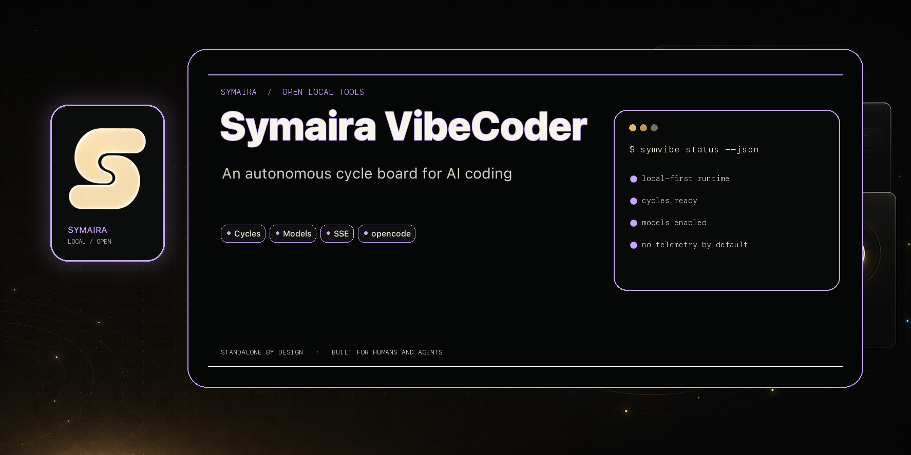
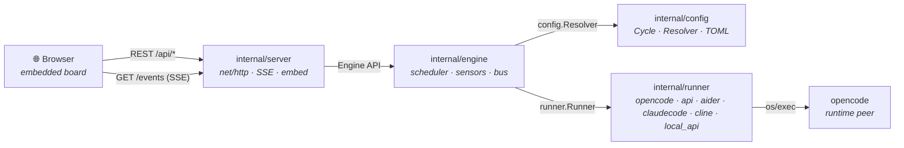

# symvibe — Vibe Coding Baukasten

[](https://github.com/danieljustus/symaira-vibecoder/actions/workflows/ci.yml)
[](https://github.com/danieljustus/symaira-vibecoder/blob/coverage-data/coverage.json)
[](https://github.com/danieljustus/symaira-vibecoder/releases)
[](https://go.dev/)
[](https://opensource.org/licenses/Apache-2.0)



> A slim graphical interface that runs your **cycle** (Cleaning → Code
> Review → Planning → Coding → PR-Check → GH Alerts → Pre-Release → Release)
> autonomously — powered by **opencode**, with per-category *and* per-step
> model selection, subagents, and unobtrusive status glyphs.

`symvibe` is part of the Symaira ecosystem: a single, CGO-free Go binary that
serves a **Baukasten board** on `127.0.0.1`. You assemble your cycle from
draggable cards (add / remove / edit / reorder via drag-&-drop) and tell the
tool to run — everything else happens autonomously.

## Architecture


```mermaid
graph LR
    Browser["🌐 Browser<br/><i>embedded board</i>"]
    Server["internal/server<br/><i>net/http · SSE · embed</i>"]
    Engine["internal/engine<br/><i>scheduler · sensors · bus</i>"]
    Config["internal/config<br/><i>Cycle · Resolver · TOML</i>"]
    Runner["internal/runner<br/><i>opencode · api · aider · claudecode · cline · local_api</i>"]
    OpenCode["opencode<br/><i>runtime peer</i>"]

    Browser -- "REST /api/*" --> Server
    Browser -- "GET /events (SSE)" --> Server
    Server -- "Engine API" --> Engine
    Engine -- "config.Resolver" --> Config
    Engine -- "runner.Runner" --> Runner
    Runner -- "os/exec" --> OpenCode
```

## Features

- **Baukasten UX** — drag-and-drop cycle builder with customizable phases and steps
- **opencode integration** — drives opencode headless via `Runner` interface (no fork required)
- **Model bindings per category/step** — assign different AI models to different parts of your cycle
- **Autonomous cycle execution** — run your entire workflow with a single click
- **iOS/macOS client** — native SwiftUI client for monitoring and controlling cycles
- **Recipe runner API** — versioned `POST /api/recipe/run` endpoint for MCP callers and vault workflows, with review mode and workspace diff capture

```
  symvibe serve  →  http://127.0.0.1:4317
  ┌──────────── Cycle ────────────────────────────────┐
  │ ① Cleaning   ◐ 1.1 Branch   ○ 1.2 Commits          │
  │ ② Code Review ✓ 2.1 Quality  ○ 2.2 Simplify …      │
  │ …  [Karten ziehen · $skill · ▦ kategorie · ▶ run]  │
  └────────────────────────────────────────────────────┘
   ○ pending  ◐ running  ✓ done  – skipped  ✕ failed  ⦸ blocked  ! review
```

## Why no fork of opencode?

`symvibe` **does not fork opencode** — it *drives* it through a swappable
`Runner` interface. opencode already provides everything needed headless
(`opencode run --format json`, `--agent/--model/--variant`, sessions, skills).
A fork would mean inheriting and maintaining the entire provider/tool/session
machinery forever. This way you own 100 % of the *vision* layer (cycle,
Baukasten, autonomy, model bindings), while the commodity agent runtime stays
a peer. A fork can always be plugged in later as another runner.

## Installation

```bash
# pre-built release (macOS / Linux)
curl -fsSL https://raw.githubusercontent.com/danieljustus/symaira-vibecoder/main/scripts/install.sh | sh

# Homebrew (requires the danieljustus/homebrew-tap repository)
brew install danieljustus/tap/symvibe

# from source (Go 1.26+)
make build && ./symvibe serve

# or directly
go install github.com/danieljustus/symaira-vibecoder/cmd/symvibe@latest
symvibe serve
```

### Runner backends

symvibe drives coding agents through a swappable `Runner` interface.
The backend in use is selected via `runner.backend` in
`~/.config/symvibe/config.toml` or the `SYMVIBE_RUNNER_BACKEND` environment
variable.

| Backend | Description | Requirement |
|---------|-------------|-------------|
| `opencode` *(default)* | Drives [`opencode`](https://opencode.ai) headless via `opencode run --format json`. Full model/skill/agent control. | `opencode` on PATH or `opencode_bin` |
| `api` | Direct Anthropic Claude API — no opencode needed. | `api_key` or `SYMVIBE_ANTHROPIC_API_KEY` |
| `aider` | Drives the [aider](https://aider.chat) CLI headless (`--message`). | `aider` on PATH or `aider_bin` |
| `claudecode` | Drives Claude Code CLI headless (`-p`). | `claude` on PATH or `claude_code_bin` |
| `cline` | Drives the [Cline](https://github.com/cline/cline) CLI headless. | `cline` on PATH or `cline_bin` |
| `local_api` | Local OpenAI-compatible endpoint (Ollama, LM Studio, MLX). | `local_api_endpoint` (e.g. `http://localhost:11434/v1`) |

Without an executable backend the board is read-only.

**Quick examples:**

```toml
# ~/.config/symvibe/config.toml
[runner]
backend = "opencode"            # or: api | aider | claudecode | cline | local_api
opencode_bin = ""               # empty = auto-detect on PATH

# For the api backend:
# backend = "api"
# api_key = "sk-ant-..."

# For the aider backend:
# backend = "aider"
# aider_bin = "/usr/local/bin/aider"

# For the local_api backend (Ollama):
# backend = "local_api"
# local_api_endpoint = "http://localhost:11434/v1"
# local_api_model = "llama3.1"
```

```bash
# Override via Environment
export SYMVIBE_RUNNER_BACKEND=api
export SYMVIBE_ANTHROPIC_API_KEY=sk-ant-...
```

**Requirements:**

- **git** is required; **gh** is optional (only for GitHub workflows).
- `symvibe doctor` checks all configured backends and shows install hints.

## Usage

```bash
symvibe serve            # start the board and open it in the browser
symvibe serve --no-open  # without opening the browser
symvibe serve --dir ~/code/my-repo   # working directory of the cycle
symvibe doctor           # check opencode/git/gh + compare model IDs against `opencode models`
symvibe pair             # generate a QR pairing code for a remote device (LAN/relay mode)
symvibe version
```

In the board:

- **Run Cycle** — runs autonomously from the current position onwards (`NextRunnable`).
- **Run only this** (▶ on a card) — run only that step.
- **Pause / Resume / Cancel** — control the run.
- **Edit** cards: bind a skill (`$00-sync` …), choose a category (model binding),
  enable/disable, delete, duplicate, move via drag-&-drop.
- Live: every card's status glyph updates in real time (SSE), and the
  activity panel shows the event stream of the running step.

## Configuration

Optional, at `~/.config/symvibe/config.toml` — see
[`config/config.example.toml`](config/config.example.toml). Without a file,
sensible defaults are used (mirrored from `oh-my-openagent.json`).

- **Model registry + category bindings** (`ultrabrain`, `deep`, `quick`,
  `git`, `writing`, `unspecified-*`) with `temperature`, `variant`,
  `fallback_models`.
- **Per-step override** beats the category (`[phases.steps.model_override]`
  in the cycle).
- Resolution: **step override > category > default**; on failure the
  `fallback_models` chain is walked down.
- Every value can be overridden via `SYMVIBE_*` env vars (`SYMVIBE_PORT`,
  `SYMVIBE_OPENCODE_BIN`, `SYMVIBE_WORKING_DIR`, …).

The cycle (Baukasten) is editable at
`~/.local/share/symvibe/cycles/<id>.toml`; the seed comes from
[`config/seed-cycle.toml`](config/seed-cycle.toml) (8 phases from
`docs/Grundidee.csv`).

## Backend override

The runner backend can be configured on three levels — each higher level
beats the lower one:

1. **Global** — `~/.config/symvibe/config.toml` or `SYMVIBE_RUNNER_BACKEND`
2. **Project-wide** — `.symvibe.toml` in the project root (same TOML schema)
3. **Per step** — `backend_override` in the cycle TOML

```toml
# Project-wide override: .symvibe.toml in the repo root
[runner]
backend = "aider"       # this project uses aider instead of opencode
```

```toml
# Per-step override in the cycle (cycles/<id>.toml)
[[phases.steps]]
id = "1.1"
name = "Sync"
backend_override = "local_api"   # run this step through the local API
```

**Resolution order:** step override > project override > global >
built-in default (`opencode`). On failure, the
`fallback_models` chain is walked down (see Configuration).

## Autonomy

- **Knows where it is:** the scheduler reads the *persisted* status of every
  step; done/skipped steps are skipped, and the run halts at the first problem
  (failed/blocked). A crash mid-step is reset on resume.
- **Knows what to skip:** a step can carry an
  `auto_skip = { sensor, when }` rule (e.g. `open-issues == 0` →
  skip the coding step). Sensors are cheap probes (`git-dirty`,
  `open-issues`, `open-prs`).

## Security

Loopback-only, unauthenticated — use locally only. *Run* lets opencode
execute real code against your repo. Details: [SECURITY.md](SECURITY.md).

## Architecture

Go core (`cmd/symvibe`, `internal/{config,engine,runner,server,version}`) +
embedded board (`web/`). See [docs/ARCHITECTURE.md](docs/ARCHITECTURE.md).

## iOS / macOS client

A SwiftPM project lives under `client/`. `SymvibeKit` contains the REST client,
SSE parser, TLS pinning and `Codable` models that follow the Go types 1:1.

The macOS client (`SymvibeApp`) builds on **symaira-appkit** and uses:

- `SymairaToolKit` to locate the bundled `symvibe` binary in
  `Contents/Resources` or on the development `PATH` (`EngineManager`).
- `SymairaKeychain` for securely storing device pairing tokens
  (`KeychainHelper`).

```bash
cd client
swift build                # macOS
# iOS: open in Xcode or use xcodebuild with an iOS simulator destination
```

The client requires iOS 17 / macOS 14.

## Recipe runner (Recipe API)

In addition to the interactive board, symvibe provides a **versioned recipe runner**
via `POST /api/recipe/run`. A recipe (`RecipeRequest`) describes:

- `workspace` — absolute path to the git repository
- `prompt` — instruction sent to the configured runner backend
- `write_cap` — maximum allowed write scope: `none`, `workspace` or `full`
- `tool_allow_list` — optionally restricted tool names
- `trace_path` — optional relative path for a replayable trace
- `review_mode` — if `true`, the workspace is reset to its original state
  after the run, once a proposed diff has been captured

The response (`RecipeResult`) contains status, duration, backend, trace and the
proposed diff. The endpoint is intended for automation / MCP callers, for
example to run vault workflows or repeatable coding tasks.

## Coverage data

CI publishes the overall coverage on every push to `main` as
`coverage.json` (including threshold and commit SHA) plus `badge.json`/`badge.svg`
to the **orphan branch `coverage-data`** (job `publish-coverage-data` in
`.github/workflows/ci.yml`). This branch is machine-maintained, never
merged, and **exempt from the branch-cleanup policy**.

## License

Apache-2.0 — see [LICENSE](LICENSE).
